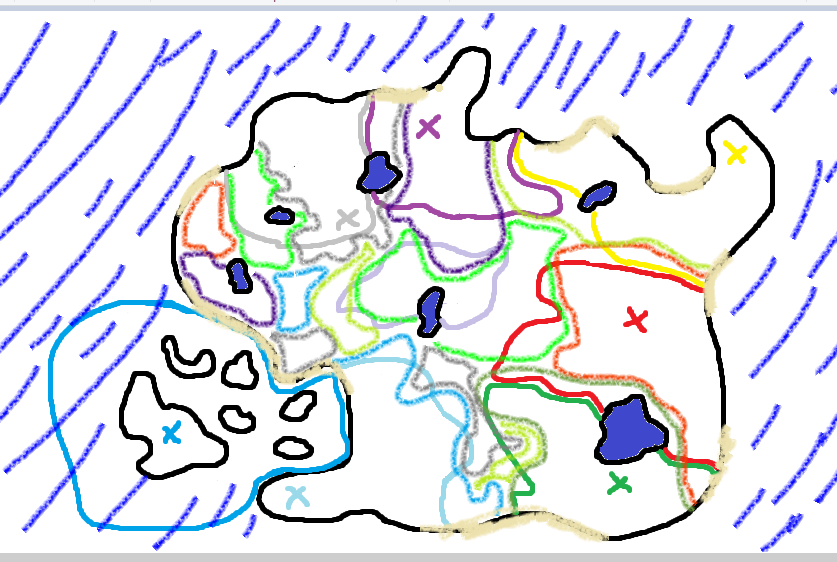

Most of the action takes place within the bounds of Supercontinent Beta, so named because it's one of the larger landmasses that has a well-defined coastline. A very rough sketch is as follows:

The coloured outlines mark the bounds of regions dominated by a particular terrain type and Field:

| Colour | Terrain     | Field                        |
|--------|-------------|------------------------------|
| Purple | ???         | Nightmare Soldiers/Dark Area |
| Yellow | Plains      | Virus Busters                |
| Red    | Volcanic    | Dragon's Roar                |
| Green  | Jungle      | Jungle Troopers              |
| Blue   | Coastal sea | Deep Savers                  |

Crosses mark the capital cities of the regions.